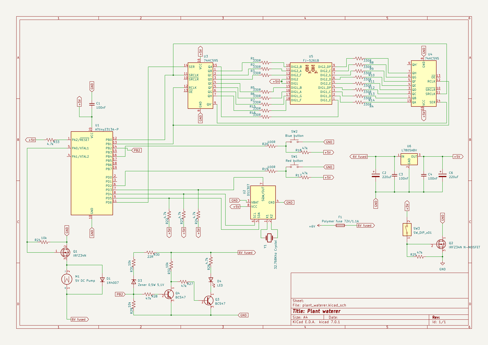
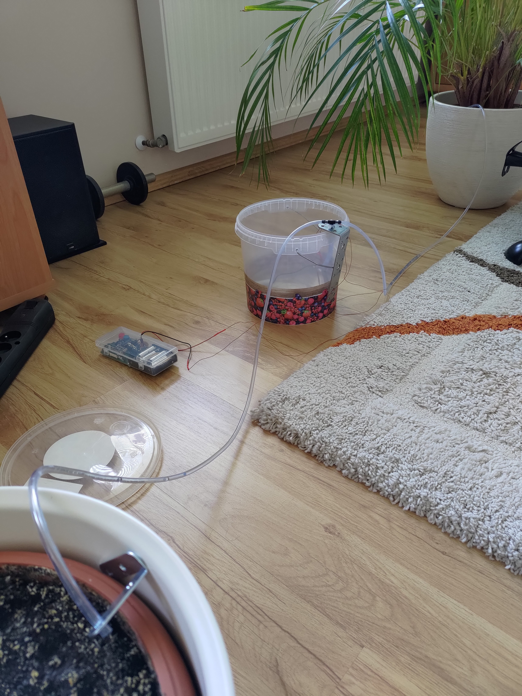
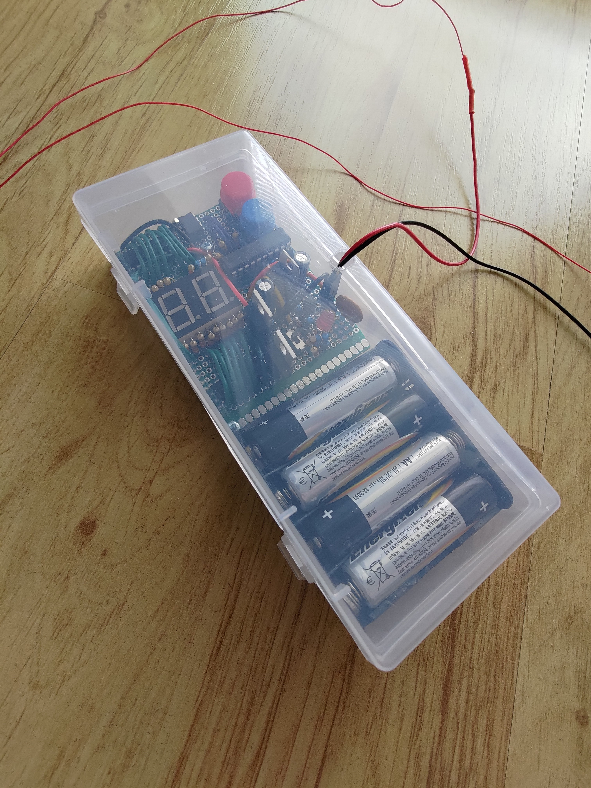

# Plant waterer

This repository contains code for a configurable plant watering device.  

## Functionalities

- it can water two plants,
- a double 7 segment display with two buttons enabling the user to:
    - configure the device,
    - display time left to the next watering,
    - display current settings.
- configuration is saved in EEPROM, which means it persists after turning off the device,
- the water pump gets turned on for a configured duration and in a configured time interval:
    - the water pumping duration can be set in minutes and seconds (max 59 minutes 59 seconds), 
    - the water pumping interval can be set in days, hours and minutes (max 45 days, 23 hours and 59 minutes), 
- powered by 4 AA batteries,
- red LED battery indicator, which turns on when the baterries are low,
- can be turned on/off using a slide switch.

## Usage

As mentioned in the "Functionalities" section, a display and two buttons are used to interact with the device.

To open the menu, press the blue button. After doing that, you'll see `I.` on the display.  
From there on, you can navigate through the menu - press:  
- the red button to select the next menu option,
- the blue button to select the previous menu option,
- both buttons to choose an option.

Each option has a specific symbol:
- `I.` - check current watering interval settings,
- `D.` - check current watering duration settings,
- `L.` - check time left to next watering,
- `SE` - go to settings,
- `I` - go to watering interval settings,
- `D` - go to watering duration settings,
- `d` - set days,
- `H` - set hours,
- `M` - set minutes,
- `S` - set seconds,
- `[ ]` - go back or exit menu.

After choosing `I.`, `D.` or `L.`, numbers will appear on the display. In case of `I.` and `L.` it will be the configured number of days (for `I.`) or the number of days left to the next watering (for `L.`). Days are not configurable for the watering duration, and the highest configurable value are minutes, therefore after pressing choosing `D.` the configured number of minutes will appear on the display.  
Pressing the red button will change the displayed value to the lower unit:  
`I.`, `L.`: days -> hours -> minutes  
`D.`: minutes -> seconds  
To navigate back, press both buttons or choose the `[ ]` exit options, which appears after going through all the values.

After choosing `d`, `H`, `M` or `S` the setting mode is activated - `00` appears on the display, and the user can use the button to increment or decrement the value.  
After pressing both buttons, the configuration gets saved in the memory, and the internal timer is reset.

## Schematic

## Components

- AVR ATtiny2313A-PU
- 33 resistors
- 5 capacitors (3 ceramic, 2 electrolytic)
- Resettable fuse 72V/1,1A
- Voltage stabilizer 5V L7805ABV
- 4 transistors (2 bipolar NPN, 2 N-MOSFET)
- Submersible 5V DC water pump 80L/h
- 7-segment display x2
- RTC clock DS1307
- Quartz resonator 32,768kHz
- 2 monostable buttons
- Slide switch
- Cell holder for 4 AA batteries
- Red LED
- Zener 0,5W 5,1V diode
- 1N4007 rectifying diode
- 2 74HC595 shift registers

<!-- ## Photos

 -->
